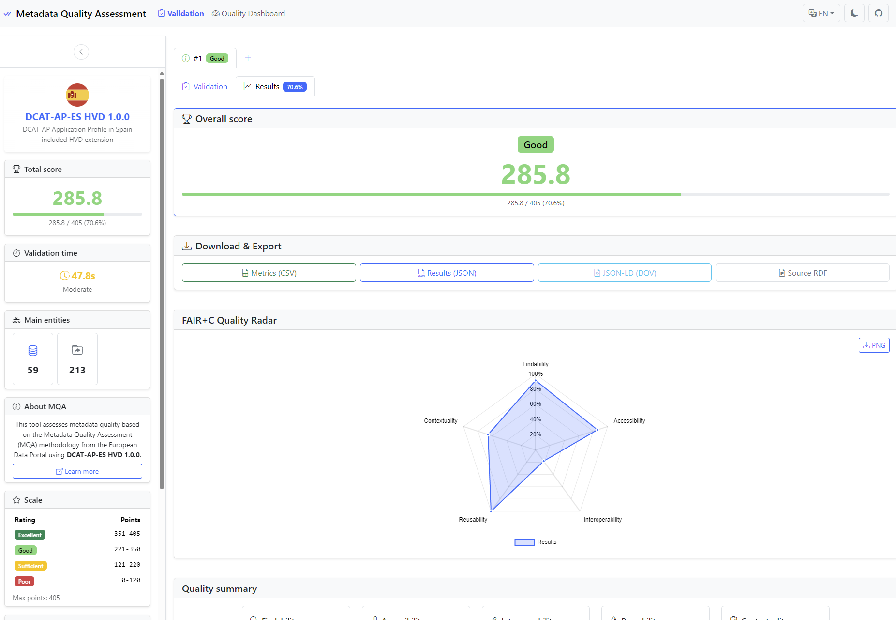
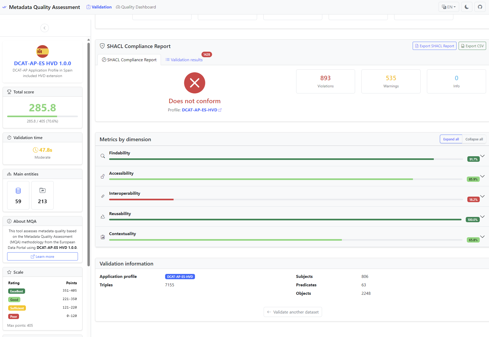
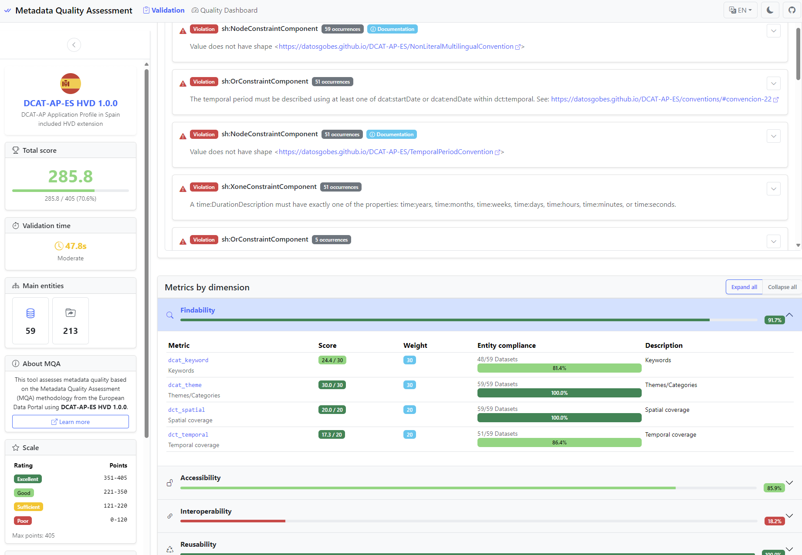
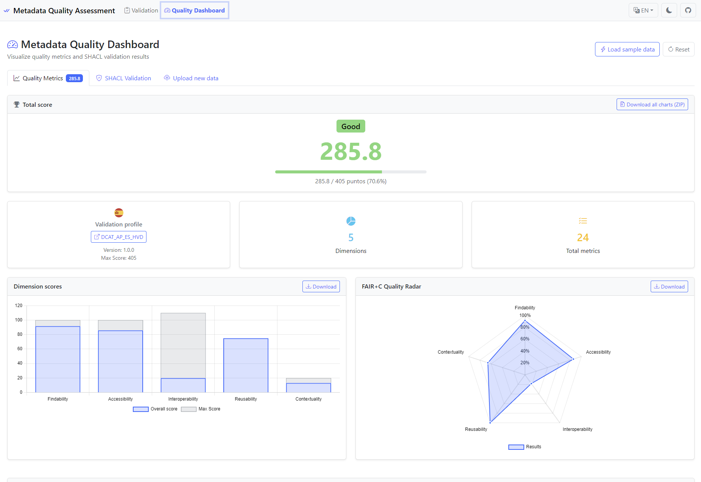

# Metadata Quality Assessment Tool - WebApp

> [!TIP]
> **Live Demo**: [https://mjanez.github.io/metadata-quality-react/](https://mjanez.github.io/metadata-quality-react/)

A modern web application for evaluating RDF metadata quality based on FAIR+C principles, built with [React](https://es.react.dev/) + [TypeScript](https://www.typescriptlang.org/docs/).

## Features
> [!TIP]
> **For Docker Compose deployment with backend support see**: [Docker](#docker-full-stack---self-hosted)

- **Complete [MQA](https://data.europa.eu/mqa/methodology) evaluation** with real metrics for [DCAT-AP](https://semiceu.github.io/DCAT-AP/), [DCAT-AP-ES](https://datosgobes.github.io/DCAT-AP-ES/) and [NTI-RISP](https://datosgobes.github.io/NTI-RISP/)
- **Data Quality Analysis** [ISO/IEC 25012](https://iso25000.com/index.php/en/iso-25000-standards/iso-25012)-based assessment for `CSV`/`JSON` distributions (*Only backend enabled*)
- **Multi-format support** `RDF/XML`, `Turtle`, `JSON-LD`, `N-Triples`, `GeoJSON` with auto-detection
- **Remote URL processing** to validate online datasets (*Full option only if backend enabled*)
- **SPARQL endpoint integration** with predefined queries for data portals
- **Dashboard** for monitoring and managing metadata quality results.
- **Interactive visualization** with [FAIR+C](https://www.go-fair.org/fair-principles/) radar charts and detailed tables
- **Controlled [vocabularies](/public/data/)** integrated (formats, licenses, access rights, etc.) from [data.europa.eu](https://gitlab.com/dataeuropa/vocabularies)
- **Responsive interface** with [Bootstrap 5](https://getbootstrap.com/docs/5.0/) and modern components
- **Full TypeScript** for safe and maintainable development






## Table of Contents

- [Tech Stack](#-tech-stack)
- [Quick Start](#-quick-start)
- [Configuration](#-configuration)
  - [MQA Profiles](#mqa-profiles)
  - [Quality Metrics](#quality-metrics)
  - [SPARQL Configuration](#sparql-configuration)
- [Development](#-development)
- [Deployment](#-deployment)
  - [Docker](#docker-full-stack---self-hosted)
  - [GitHub Pages](#github-pages-frontend-only)
- [Architecture](#-architecture)
- [Internationalization](#-internationalization)
- [Theming](#-theming)
- [Troubleshooting](#-troubleshooting)

## Tech Stack

| Technology | Version | Purpose |
|------------|---------|---------|
| [**React**](https://github.com/facebook/react) | 19.1.10 | UI framework with modern hooks |
| [**TypeScript**](https://github.com/microsoft/TypeScript) | 4.9.5 | Static typing and safe development |
| [**N3.js**](https://github.com/rdfjs/N3.js) | 1.26.0 | RDF parsing and manipulation |
| [**rdfxml-streaming-parser**](https://github.com/rdfjs/rdfxml-streaming-parser.js) | 3.1.0 | RDF/XML → Turtle conversion |
| [**shacl-engine**](https://github.com/rdf-ext/shacl-engine) | 1.0.2 | A fast RDF/JS SHACL engine includes SHACL SPARQL-based Constraints |
| [**Bootstrap**](https://github.com/twbs/bootstrap) | 5.3.7 | Responsive CSS framework |
| [**Chart.js**](https://github.com/chartjs/Chart.js) | 4.5.0 | Radar charts visualization |
| [**react-i18next**](https://github.com/i18next/react-i18next) | Latest | Internationalization support |
| [**gh-pages**](https://github.com/tschaub/gh-pages) | 6.3.0 | Automated GitHub Pages deployment |

## Quick Start

### Quick deployment (Docker Compose)

**Prerequisites**: [Docker and Docker Compose](https://docs.docker.com/get-started/get-docker/) installed

```bash
# Clone repository
git clone https://github.com/mjanez/metadata-quality-react.git
cd metadata-quality-react

# Start with pre-built image from GHCR
docker compose up -d

# Or build locally
IMAGE_TAG=local docker compose up -d --build
```

> [!TIP]
> Application will be available at: **https://localhost:443** (HTTP auto-redirects to HTTPS)
> - Frontend: https://localhost:443
> - Backend API: https://localhost:443/api/health

### Development Setup

**Prerequisites**: Node.js >= 16.x, npm >= 8.x

```bash
# Quick start (both frontend and backend)
./dev-start.sh

# Or manually:
# Install dependencies
npm install

# Start development server (frontend only)
npm start

# Optional: Start backend server (in separate terminal)
cd backend
npm i && npm start
```

> [!TIP]
> Development servers:
> - Frontend: **http://localhost:3000**
> - Backend API: **http://localhost:3001/api/health**

## Configuration

The application is configured through the `src/config/mqa-config.json` file, which centralizes all settings for profiles, metrics, and SPARQL endpoints. This configuration file follows a structured approach to support multiple metadata standards and quality assessment methodologies.

### MQA Profiles

Profiles define the metadata standards (DCAT-AP, DCAT-AP-ES, NTI-RISP) with their specific versions and validation rules.

#### Profile Structure

```json
{
  "profiles": {
    "profile_id": {
      "versions": {
        "version_number": {
          "name": "Display Name",
          "maxScore": 405,
          "icon": "img/icons/icon.svg",
          "url": "https://profile-documentation-url",
          "sampleUrl": "https://sample-data-url",
          "shaclFiles": [
            "https://shacl-validation-file-1.ttl",
            "https://shacl-validation-file-2.ttl"
          ],
          "dimensions": {
            "findability": { "maxScore": 100 },
            "accessibility": { "maxScore": 100 },
            "interoperability": { "maxScore": 110 },
            "reusability": { "maxScore": 75 },
            "contextuality": { "maxScore": 20 }
          }
        }
      },
      "defaultVersion": "version_number"
    }
  }
}
```

#### Adding a New Profile

1. **Create the profile structure** in `mqa-config.json`:
```json
"my_custom_profile": {
  "versions": {
    "1.0.0": {
      "name": "My Custom Profile 1.0.0",
      "maxScore": 400,
      "icon": "img/icons/custom.svg",
      "url": "https://my-profile-docs.com",
      "sampleUrl": "https://my-sample-data.ttl",
      "shaclFiles": [
        "https://my-shacl-validation.ttl"
      ],
      "dimensions": {
        "findability": { "maxScore": 100 },
        "accessibility": { "maxScore": 100 },
        "interoperability": { "maxScore": 100 },
        "reusability": { "maxScore": 75 },
        "contextuality": { "maxScore": 25 }
      }
    }
  },
  "defaultVersion": "1.0.0"
}
```

2. **Add corresponding metrics** in the `profile_metrics` section
3. **Add icon file** to `public/img/icons/`
4. **Update translations** in `public/locales/en/translation.json` and `public/locales/es/translation.json`

### Quality Metrics

Metrics define how quality is measured for each FAIR+C dimension. Each metric has an ID, weight, and associated RDF property.

#### Metric Structure

```json
{
  "profile_metrics": {
    "profile_id": {
      "dimension_name": [
        {
          "id": "metric_identifier",
          "weight": 30,
          "property": "rdf:property"
        }
      ]
    }
  }
}
```

#### Adding New Metrics

1. **Define the metric** in the appropriate profile and dimension:
```json
"findability": [
  {
    "id": "my_custom_metric",
    "weight": 25,
    "property": "my:customProperty"
  }
]
```

2. **Add metric labels** to translation files:
```json
{
  "metrics": {
    "specific": {
      "my_custom_metric": "My Custom Metric"
    }
  }
}
```

3. **Implement evaluation logic** in `src/services/MQAService.ts` if needed

#### FAIR+C Dimensions

| Dimension | Code | Description | Typical Metrics |
|-----------|------|-------------|----------------|
| **Findability** | `findability` | How easily the dataset can be found | Keywords, themes, spatial/temporal coverage |
| **Accessibility** | `accessibility` | How accessible the data is | Access URLs, download URLs, status checks |
| **Interoperability** | `interoperability` | Technical interoperability | Formats, media types, standards compliance |
| **Reusability** | `reusability` | How easily the data can be reused | Licenses, access rights, contact information |
| **Contextuality** | `contextuality` | Contextual information provided | Size, dates, rights information |

### SPARQL Configuration

The SPARQL configuration enables integration with data portals and endpoints for automated data retrieval and validation.

#### SPARQL Structure

```json
{
  "sparql_config": {
    "default_endpoint": "https://sparql-endpoint-url",
    "queries": {
      "profile_id": [
        {
          "id": "query_identifier",
          "name": "Human-readable name",
          "description": "Query description",
          "query": "SPARQL query string with {parameter} placeholders",
          "parameters": [
            {
              "name": "parameter_name",
              "label": "Parameter Label",
              "type": "text",
              "required": true,
              "placeholder": "Enter value...",
              "description": "Parameter description"
            }
          ]
        }
      ]
    }
  }
}
```

#### Adding SPARQL Queries

1. **Define the query** for a specific profile:
```json
"my_profile": [
  {
    "id": "my_custom_query",
    "name": "Custom Data Query",
    "description": "Retrieves custom dataset information",
    "query": "PREFIX dcat: <http://www.w3.org/ns/dcat#>\nCONSTRUCT {\n  ?dataset a dcat:Dataset ;\n    dct:title ?title .\n}\nWHERE {\n  ?dataset a dcat:Dataset ;\n    dct:publisher ?publisher ;\n    dct:title ?title .\n  FILTER (regex(str(?publisher), \"{org_id}\", \"i\"))\n}\nLIMIT {limit}",
    "parameters": [
      {
        "name": "org_id",
        "label": "Organization ID",
        "type": "text",
        "required": true,
        "placeholder": "e.g., ministry-of-health",
        "description": "Identifier of the organization"
      },
      {
        "name": "limit",
        "label": "Result Limit",
        "type": "number",
        "required": false,
        "placeholder": "50",
        "description": "Maximum number of results"
      }
    ]
  }
]
```

2. **Parameter Types Available**:
   - `text`: Text input
   - `number`: Numeric input
   - `select`: Dropdown (requires `options` array)
   - `textarea`: Multi-line text

3. **Query Features**:
   - **Parameter substitution**: Use `{parameter_name}` in queries
   - **CONSTRUCT queries**: Preferred for generating valid RDF
   - **Endpoint testing**: Use debug queries to test connectivity

#### Debug Queries

Special debug queries help test endpoint connectivity:

```json
"debug": [
  {
    "id": "test_endpoint",
    "name": "Test Endpoint",
    "description": "Verify endpoint connectivity",
    "query": "SELECT * WHERE { ?s ?p ?o } LIMIT 10",
    "parameters": []
  }
]
```

### Configuration Best Practices

1. **Profile Naming**: Use consistent IDs (`dcat_ap`, `dcat_ap_es`, `dcat_ap_es_hvd` `nti_risp`)
2. **Version Management**: Support multiple versions per profile
3. **Metric Weights**: Ensure weights sum to reasonable totals per dimension
4. **SPARQL Queries**: Use CONSTRUCT queries for better RDF generation
5. **Parameter Validation**: Provide clear descriptions and examples
6. **Icon Management**: Store icons in `public/img/icons/` as SVG
7. **Translation Keys**: Keep metric IDs consistent across profiles

## Development

| Script | Command | Description |
|--------|---------|-------------|
| **Development (Full)** | `./dev-start.sh` | Start both frontend and backend servers |
| **Development (Frontend)** | `npm start` | Local server with hot reload (frontend only) |
| **Cleanup** | `./dev-cleanup.sh` | Stop all development servers and clean ports |
| **Build** | `npm run build` | Optimized production build |
| **Deploy** | `npm run deploy` | Automatic deploy to GitHub Pages |
| **Test** | `npm test` | Run tests (if any) |

### File Structure

```
react-app/
├── public/
│   ├── data/                    # JSONL vocabularies
│   │   ├── access_rights.jsonl
│   │   ├── file_types.jsonl
│   │   ├── licenses.jsonl
│   │   └── ...
│   ├── locales/                 # i18n translations
│   │   ├── en/translation.json  # English translations + metrics labels
│   │   └── es/translation.json  # Spanish translations + metrics labels
│   └── img/icons/               # Profile icons
├── src/
│   ├── components/              # React components
│   │   ├── ValidationForm.tsx   # Input form + SPARQL integration
│   │   ├── ValidationResults.tsx # Results and charts
│   │   ├── QualityChart.tsx     # FAIR+C radar chart
│   │   └── ...
│   ├── services/                # Business logic
│   │   ├── MQAService.ts        # Main MQA engine + metric evaluation
│   │   ├── SPARQLService.ts     # SPARQL endpoint integration
│   │   └── RDFService.ts        # RDF processing
│   ├── config/                  # Configuration
│   │   └── mqa-config.json      # **Central configuration file**
│   ├── types/                   # TypeScript types
│   └── i18n/                    # Internationalization setup
└── package.json
```

## Deployment
This application can be deployed on multiple platforms with different configurations.
> [!WARNING]
> **Before deploying, verify your configuration!**
> **Quick Configuration Check:**
> ```bash
> # Check current settings
> grep -A 1 '\"enabled\"' src/config/mqa-config.json
> # Expected for GitHub Pages:
> # backend_server: \"enabled\": false
> # data_quality: \"enabled\": false
> # Expected for Docker:
> # backend_server: "enabled": true
> # data_quality: \"enabled\": true
> ```
> 📖 **See full guide:** [docs/DEPLOYMENT_CONFIG.md](docs/DEPLOYMENT_CONFIG.md)

### Supported Platforms

| Platform | Frontend | Backend | Auto HTTPS | Free Tier | CI/CD | Backend Config | Data Quality | Best For |
|----------|----------|---------|------------|-----------|-------|---------------|----------------|----------|
| **Docker** | ✅ | ✅ (Express) | ⚙️ | - | ⚙️ | `enabled: true` | ✅ Full analysis | Self-hosted (Full control) |
| **GitHub Pages** | ✅ | ❌ | ✅ | ✅ | ✅ | `enabled: false` | ❌ Limited | Demo/Docs (No backend) |

---

### Docker (Full Stack - Self Hosted)

**Features**: Full control, both frontend and backend, custom domain support

> [!NOTE]  
> **Docker Configuration**: For Docker deployment, backend features should be **enabled** in `mqa-config.json`:
> ```json
> {
>   "backend_server": {
>     "enabled": true,
>     "url": ""
>   },
>   "data_quality": {
>     "enabled": true,
>     "require_backend": true
>   }
> }
> ```

#### Quick Start

```bash
# 1. Clone and configure
git clone https://github.com/mjanez/metadata-quality-react.git
cd metadata-quality-react
cp .env.example .env

# 2. Start with pre-built image (recommended)
docker compose up -d

# Or build locally
IMAGE_TAG=local docker compose up -d --build

# 3. Access application
# Frontend: https://localhost:443
# Backend API: https://localhost:443/api/health
```

> [!NOTE]
> By default, uses the latest stable image from GHCR. Set `IMAGE_TAG=develop` for development version or `IMAGE_TAG=local` to build locally.

#### Deployment Modes

| Mode | Command | Use Case | Features |
|------|---------|----------|----------|
| **Production (GHCR)** | `docker compose up -d` | Self-hosted with pre-built image | Fast deployment, auto-updates, SSL, caching |
| **Development (Local)** | `IMAGE_TAG=local docker compose up -d --build` | Local build and testing | Custom changes, SSL, caching, auto-restart |

#### Container Services

```yaml
services:
  mqa-app:           # React frontend + Express backend
    ports:
      - "3000:3000"  # Frontend
      - "3001:3001"  # Backend API
  
  nginx:             # Reverse proxy (production profile)
    ports:
      - "80:80"      # HTTP
      - "443:443"    # HTTPS (requires SSL configuration)
```

#### Configuration

**Environment Variables** (`.env` file):
```env
# Port Configuration
FRONTEND_PORT=3000
BACKEND_PORT=3001

# Application
PUBLIC_URL=/
REACT_APP_BACKEND_URL=http://localhost:3001/api
NODE_ENV=production
```

**Custom Configuration**:
```yaml
volumes:
  # Mount custom MQA config
  - ./mqa-config.json:/app/build/config/mqa-config.json:ro
  
  # Mount custom vocabularies
  - ./public/data:/app/build/data:ro
```

#### Management Commands

```bash
# View logs
docker compose logs -f mqa-app

# Restart services
docker compose restart

# Stop and remove
docker compose down

# Update and rebuild
docker compose up -d --build

# Health check
curl http://localhost:3000/
curl http://localhost:3001/api/health
```

#### GitHub Container Registry (GHCR)

Pre-built Docker images are automatically published to GitHub Container Registry on every push and pull request.

**Quick Deploy**:
```bash
# Pull latest stable version
docker pull ghcr.io/mjanez/metadata-quality-react:latest

# Run with docker
docker run -d -p 3000:3000 -p 3001:3001 \
  ghcr.io/mjanez/metadata-quality-react:latest

# Or with docker compose
cat > docker-compose.yml << EOF
services:
  mqa-app:
    image: ghcr.io/mjanez/metadata-quality-react:latest
    ports:
      - "3000:3000"
      - "3001:3001"
    environment:
      - NODE_ENV=production
    restart: unless-stopped
EOF

docker compose up -d
```

**Available Tags**:
- `latest` - Latest stable version (main branch)
- `develop` - Development version (develop branch)
- `pr-<number>` - Pull request specific image
- `v1.2.3` - Semantic versioning tags

**Multi-Architecture Support**: Images built for `linux/amd64` and `linux/arm64` (Apple Silicon/ARM servers)

**See**: [GHCR Documentation](.github/GHCR.md) for complete details on image tags, security scanning, and usage.

---

#### Production Deployment with SSL

1. **Generate SSL certificates** (automatic self-signed for development):
```bash
# Generate self-signed certificate (local development)
make ssl-generate
# or
./docker/nginx/generate-ssl.sh

# For production: replace with valid certificates
# See docker/README.md#ssl-configuration
```

2. **Start with nginx profile**:
```bash
# HTTP automatically redirects to HTTPS
docker compose up -d
# or
make up-prod
```

3. **Access via HTTPS**:
```
https://localhost (development - will show browser warning)
https://your-domain.com (production with valid certificate)
```

> [!NOTE]
> **Self-signed certificates**: Browsers will show a security warning. This is normal for local development.
> **Production**: Replace certificates in `docker/nginx/ssl/` with valid ones from Let's Encrypt or a CA.

#### Alternative: Full Stack Deployment

For complete deployment with API backend (Python FastAPI):
```bash
git clone https://github.com/mjanez/metadata-quality-stack
cd metadata-quality-stack
docker compose up -d
```

Includes:
- React frontend (this project)
- Python FastAPI backend
- Streamlit dashboard
- Nginx reverse proxy
- Volume persistence

#### Troubleshooting

| Issue | Solution |
|-------|----------|
| Port in use | Change `FRONTEND_PORT` or `BACKEND_PORT` in `.env` |
| Build fails | `docker compose build --no-cache` |
| Network issues | `docker compose down && docker network prune` |
| Permission errors | `sudo chown -R $USER:$USER .` |

---

### GitHub Pages (Frontend Only)

**Features**: Simple static hosting, free for public repos, no backend support

> [!IMPORTANT]  
> **GitHub Pages Configuration**: For GitHub Pages deployment, you **MUST** disable backend features in `mqa-config.json`:
> ```json
> {
>   "backend_server": {
>     "enabled": false
>   },
>   "data_quality": {
>     "enabled": false
>   }
> }
> ```
> 
> **Why**: GitHub Pages only serves static files and cannot run backend services. Leaving these enabled will cause:
> - Failed API requests and console errors
> - Non-functional data quality analysis features  
> - Degraded user experience with loading states that never complete

#### Prerequisites
- Repository must be public
- GitHub Pages must be enabled in repository settings

#### Automatic Deployment
```bash
# Deploy to GitHub Pages
npm run deploy
```

This command:
1. Builds the application with correct `PUBLIC_URL`
2. Deploys to `gh-pages` branch
3. Makes it available at: `https://{username}.github.io/{repo-name}/`

#### Manual Deployment
```bash
# 1. Build with correct base path
npm run build

# 2. Deploy using gh-pages
npx gh-pages -d build
```

---

### Local Development with Backend

For complete local development including backend:

#### Option 1: Automatic Setup (Recommended)
```bash
# Install dependencies and start both servers
./dev-start.sh

# If ports are occupied, clean up first:
./dev-cleanup.sh && ./dev-start.sh
```

#### Option 2: Manual Setup
```bash
# Terminal 1: Start backend server
cd backend
npm install
npm start
# Backend running on http://localhost:3001

# Terminal 2: Start React app
npm install
npm start
# Frontend running on http://localhost:3000
```

**Environment Setup:**

The `.env.local` file is automatically configured for local development:
```env
# Local development configuration (already configured)
BROWSER=none
PORT=3000
BACKEND_PORT=3001
REACT_APP_BACKEND_URL=http://localhost:3001/api
REACT_APP_ENV=development
```

**Custom Configuration:**

To modify ports or settings, edit `.env.local`:
```env
# Change frontend port
PORT=3005

# Change backend port
BACKEND_PORT=3002
REACT_APP_BACKEND_URL=http://localhost:3002/api
```

**Development Script Features:**

The `./dev-start.sh` script automatically:
- Checks Node.js and npm installation
- Installs dependencies if missing
- Loads environment variables from `.env.local`
- Starts backend server on configured port (default: 3001)
- Starts frontend development server on configured port (default: 3000)
- Verifies backend health check
- Handles graceful shutdown on Ctrl+C

**Backend Configuration:**

The backend (`backend/server.js`) provides:
- CORS proxy for accessing external RDF data
- URL validation to check accessibility
- Data download with SSL certificate handling
- Health check endpoint
- Batch URL validation for performance

**API Endpoints:**
```bash
GET  /api/health                    # Health check
POST /api/validate-url              # Single URL validation
POST /api/validate-urls-batch       # Batch URL validation (performance)
POST /api/download-data             # Download and proxy data
```

**Port Configuration:**

| Service | Default Port | Environment Variable | Configuration File |
|---------|--------------|---------------------|-------------------|
| Frontend | 3000 | `PORT` | `.env.local` |
| Backend | 3001 | `BACKEND_PORT` | `.env.local` |

---

## Architecture

### Component Overview


### Data Flow

1. **Configuration Loading**: `mqa-config.json` → Services
2. **User Input**: Form data → ValidationForm
3. **SPARQL Integration**: Queries → SPARQLService → RDF data
4. **RDF Processing**: Raw data → RDFService → Parsed triples
5. **Quality Assessment**: Triples → MQAService → Metrics scores
6. **Visualization**: Scores → Chart components → User interface

### Supported Profiles

- **DCAT-AP 2.1.1**: 405 maximum points
- **DCAT-AP 3.0.0**: 405 maximum points  
- **DCAT-AP-ES 1.0.0**: 405 maximum points
- **NTI-RISP 2013**: 305 maximum points

### FAIR+C Quality Model
| Dimension | Description |
|-----------|-------------|
| **F** - Findability | Ease of finding the dataset |
| **A** - Accessibility | Data accessibility |
| **I** - Interoperability | Technical interoperability |
| **R** - Reusability | Ease of reuse |
| **C** - Contextuality | Contextual information |

## Internationalization

### Languages Supported
- **English** (default)
- **Spanish** (Español)

### Adding New Languages
1. Create translation file in `public/locales/{lang}/translation.json`
2. Add language option to `LanguageSelector` component
3. Update i18n configuration in `src/i18n/index.ts`

### Translation Structure

Translation files in `public/locales/{lang}/translation.json` include both UI labels and metric definitions:

```json
{
  "common": {
    "title": "Metadata Quality Assessment",
    "loading": "Loading...",
    "validate": "Validate"
  },
  "dimensions": {
    "findability": "Findability",
    "accessibility": "Accessibility",
    "interoperability": "Interoperability", 
    "reusability": "Reusability",
    "contextuality": "Contextuality"
  },
  "metrics": {
    "labels": {
      "name": "Métrica",
      "score": "Puntuación",
      ...
    },
    "specific": {
      "dcat_keyword": "Palabras clave",
      "dcat_theme": "Temas/Categorías",
      "dct_spatial": "Cobertura espacial",
      "dct_temporal": "Cobertura temporal",
      "dcat_access_url_status": "Disponibilidad de la URL de acceso"
      ...
    }
  }
}
```

The `metrics.specific` section contains all quality metric translations and is integrated with the MQA evaluation system.

## Theming
### Customizing Styles
Edit these files:
- `src/App.css` - Main application styles
- `src/components/*.css` - Component-specific styles
- Bootstrap variables can be overridden in CSS

### Theme Variables
```css
:root {
  --bs-primary: #0d6efd;
  --mqa-chart-bg: #ffffff;
  --mqa-text-color: #212529;
}

[data-bs-theme="dark"] {
  --mqa-chart-bg: #212529;
  --mqa-text-color: #ffffff;
}
```

### Vocabulary Data

Controlled vocabularies are stored in `public/data/` as JSONL files for efficient loading:

| File | Purpose | Usage |
|------|---------|-------|
| `access_rights.jsonl` | Access rights vocabulary | License validation |
| `file_types.jsonl` | File format types | Format classification |
| `licenses.jsonl` | License definitions | License compliance |
| `machine_readable.jsonl` | Machine-readable formats | Interoperability metrics |
| `media_types.jsonl` | MIME media types | Format validation |
| `non_proprietary.jsonl` | Non-proprietary formats | Openness assessment |

#### Updating Vocabularies

```bash
# Convert CSV vocabularies to JSONL format
python3 scripts/vocabs_csv2jsonl.py
```

## Troubleshooting

### Build Errors
```bash
# Clear cache
rm -rf node_modules/.cache
npm run build
```

### Type Errors
```bash
# Check types without build
npx tsc --noEmit
```

### Deploy Issues
```bash
# Check gh-pages branch
git checkout gh-pages
git log --oneline -5

# Force redeploy
npm run deploy -- --force
```

### i18n Issues
```bash
# Check translation files
cat public/locales/en/translation.json
cat public/locales/es/translation.json
```

### Configuration Issues

```bash
# Validate mqa-config.json syntax
npm run build 2>&1 | grep -i "config\|json"

# Check for missing metric labels
grep -r "metrics.specific" public/locales/
```

### Deployment Configuration Issues

**Backend Server Configuration Errors:**
```bash
# Check current backend_server configuration
grep -A 10 '"backend_server"' src/config/mqa-config.json

# Common fixes:
# For GitHub Pages: Set "enabled": false
# For Docker: Set "enabled": true, "url": ""
# For local dev: Set "enabled": true, "url": "http://localhost:3001/api"
```

**Data Quality Configuration Errors:**
```bash
# Check current data_quality configuration  
grep -A 5 '"data_quality"' src/config/mqa-config.json

# GitHub Pages: Must be "enabled": false (no backend support)
# Docker/Local: Can be "enabled": true (backend available)
```

**Configuration by Deployment Type:**
| Deployment | backend_server.enabled | data_quality.enabled | Reason |
|------------|----------------------|---------------------|--------|
| GitHub Pages | `false` | `false` | No backend services available |
| Docker | `true` | `true` | Full backend support with Express API |
| Local Dev | `true` | `true` | Backend runs on localhost:3001 |
| Static Hosting | `false` | `false` | Similar to GitHub Pages |

### Development Issues

```bash
# Port already in use error
./dev-cleanup.sh  # Clean up occupied ports
./dev-start.sh    # Restart development servers

# Backend connection issues
curl http://localhost:3001/api/health  # Check backend health
cat .env.local                         # Verify configuration

# Frontend can't reach backend
# Check that REACT_APP_BACKEND_URL matches actual backend port
grep REACT_APP_BACKEND_URL .env.local
```

### Performance Issues

```bash
# Analyze bundle size
npm run build && npx webpack-bundle-analyzer build/static/js/*.js

# Check for memory leaks in development
npm start -- --profile
```

## Contributing

### Adding New Features

1. **New Profile Support**:
   - Update `mqa-config.json` with profile definition
   - Add SHACL validation files
   - Create profile icon in `public/img/icons/`
   - Add translations for profile name and metrics

2. **New Quality Metrics**:
   - Define metric in `profile_metrics` section
   - Implement evaluation logic in `MQAService.ts`
   - Add metric labels to translation files
   - Update documentation

3. **SPARQL Queries**:
   - Add queries to `sparql_config.queries`
   - Test with debug queries first
   - Document parameter usage
   - Provide sample data URLs

### Code Standards

- **TypeScript**: Strict mode enabled, no `any` types
- **React**: Functional components with hooks
- **CSS**: Bootstrap 5 + custom CSS variables
- **i18n**: All user-facing text must be translatable
- **Testing**: Add tests for new services and components

## License

This project is licensed under the MIT License. See the [LICENSE](../LICENSE) file for details.

---

**Built with ❤️ for the Open Data community**
