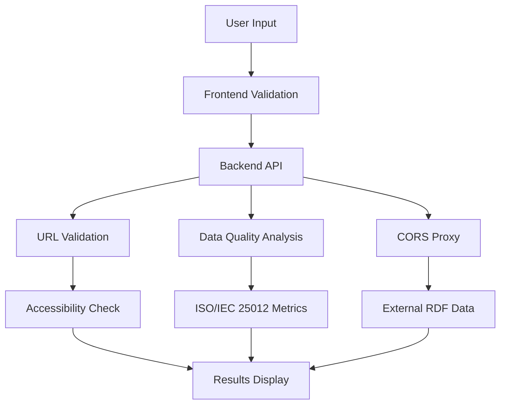
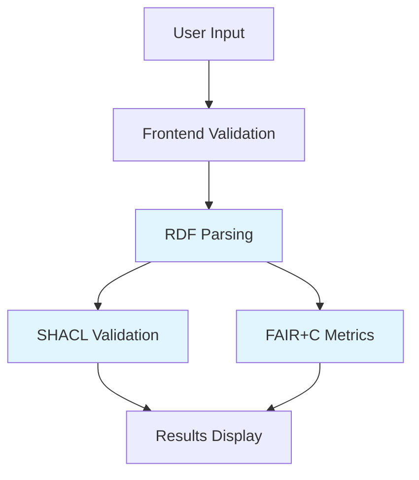

# Deployment Configuration Guide

This guide explains how to properly configure `mqa-config.json` for different deployment scenarios.

## Configuration Overview

The `mqa-config.json` file contains two critical settings that must be configured based on your deployment type:

```json
{
  "backend_server": {
    "enabled": true|false,
    "url": "..."
  },
  "data_quality": {
    "enabled": true|false,
    "require_backend": true
  }
}
```

## Deployment Types

### 🐳 Docker Deployment (Full Stack)

**Configuration Required:**
```json
{
  "backend_server": {
    "enabled": true,
    "url": "",
    "_comment": "Empty url means it will use REACT_APP_BACKEND_URL from env or default to /api"
  },
  "data_quality": {
    "enabled": true,
    "require_backend": true
  }
}
```

**Features Available:**
- ✅ Full URL validation and accessibility checking
- ✅ Data quality analysis for CSV/JSON distributions (ISO/IEC 25012)
- ✅ CORS proxy for accessing external RDF data
- ✅ Batch URL validation for better performance
- ✅ SSL certificate handling for HTTPS URLs
- ✅ Backend API endpoints (/api/validate-url, /api/download-data)

**Why This Works:**
- Docker container includes Express backend server
- Backend runs on port 3001, frontend on port 3000
- Nginx reverse proxy routes /api requests to backend
- All backend-dependent features function correctly

---

### 📄 GitHub Pages Deployment (Static Only)

**Configuration Required:**
```json
{
  "backend_server": {
    "enabled": false
  },
  "data_quality": {
    "enabled": false
  }
}
```

**Features Available:**
- ✅ RDF metadata validation and parsing
- ✅ FAIR+C quality metrics calculation
- ✅ SHACL validation for compliance checking
- ✅ Interactive charts and visualizations
- ❌ URL accessibility validation (limited to basic checks)
- ❌ Data quality analysis for distributions
- ❌ CORS proxy functionality
- ❌ Backend API endpoints

**Why Backend Must Be Disabled:**
- GitHub Pages only serves static HTML/CSS/JS files
- No server-side processing capabilities
- API calls to `/api/*` endpoints will result in 404 errors
- Enabling backend features causes:
  - Failed API requests and console errors
  - Infinite loading states for backend-dependent features
  - Degraded user experience

---

### 🏠 Local Development

**Configuration Required:**
```json
{
  "backend_server": {
    "enabled": true,
    "url": "http://localhost:3001/api"
  },
  "data_quality": {
    "enabled": true,
    "require_backend": true
  }
}
```

**Setup:**
```bash
# Start both services
./dev-start.sh

# Or manually:
# Terminal 1: Backend
cd backend && npm start

# Terminal 2: Frontend  
npm start
```

**Features Available:**
- Same as Docker deployment
- Backend runs on localhost:3001
- Frontend runs on localhost:3000
- Hot reload for development

---

### 🌐 Static Hosting (Netlify, Vercel, etc.)

**Configuration Required:**
```json
{
  "backend_server": {
    "enabled": false
  },
  "data_quality": {
    "enabled": false  
  }
}
```

**Features Available:**
- Same limitations as GitHub Pages
- No backend processing capabilities
- Static file serving only

## Configuration Validation

### Check Current Configuration

```bash
# Check backend_server settings
grep -A 10 '"backend_server"' src/config/mqa-config.json

# Check data_quality settings  
grep -A 5 '"data_quality"' src/config/mqa-config.json
```

### Validate Configuration

Use this checklist to ensure proper configuration:

| Deployment Type | backend_server.enabled | data_quality.enabled | URL Config | Expected Behavior |
|-----------------|----------------------|---------------------|-------------|------------------|
| Docker | ✅ `true` | ✅ `true` | `""` (empty) | Full functionality |
| GitHub Pages | ❌ `false` | ❌ `false` | N/A | Static functionality only |
| Local Dev | ✅ `true` | ✅ `true` | `http://localhost:3001/api` | Full functionality |
| Static Hosting | ❌ `false` | ❌ `false` | N/A | Static functionality only |

### Common Configuration Errors

#### ❌ GitHub Pages with Backend Enabled

**Problem:**
```json
{
  "backend_server": { "enabled": true },
  "data_quality": { "enabled": true }
}
```

**Symptoms:**
- Console errors: `Failed to fetch from /api/health`
- Loading spinners that never complete
- "Backend service unavailable" warnings
- Non-functional URL validation

**Solution:**
```json
{
  "backend_server": { "enabled": false },
  "data_quality": { "enabled": false }
}
```

#### ❌ Docker with Backend Disabled

**Problem:**
```json
{
  "backend_server": { "enabled": false },
  "data_quality": { "enabled": false }
}
```

**Symptoms:**
- Missing data quality analysis features
- Limited URL validation capabilities
- Underutilized backend container resources

**Solution:**
```json
{
  "backend_server": { "enabled": true, "url": "" },
  "data_quality": { "enabled": true, "require_backend": true }
}
```

## Feature Comparison

### With Backend Enabled (Docker, Local Dev)



### Without Backend (GitHub Pages, Static)



## Deployment Commands

### For GitHub Pages
```bash
# 1. Ensure backend is disabled in mqa-config.json
sed -i 's/"enabled": true/"enabled": false/g' src/config/mqa-config.json

# 2. Build and deploy
npm run deploy
```

### For Docker
```bash
# 1. Ensure backend is enabled in mqa-config.json  
sed -i 's/"enabled": false/"enabled": true/g' src/config/mqa-config.json

# 2. Build and run
docker compose up -d
```

### For Local Development
```bash
# 1. Ensure proper local configuration
cat > .env.local << EOF
PORT=3000
BACKEND_PORT=3001
REACT_APP_BACKEND_URL=http://localhost:3001/api
EOF

# 2. Start development servers
./dev-start.sh
```

## Troubleshooting

### Backend Connection Issues

```bash
# Test backend connectivity (Docker/Local only)
curl http://localhost:3001/api/health

# Expected response:
# {"status":"ok","timestamp":"2024-01-01T00:00:00.000Z"}
```

### Configuration Verification

```bash
# Quick configuration check script
echo "Backend Server: $(grep -A 1 'backend_server' src/config/mqa-config.json | grep enabled)"
echo "Data Quality: $(grep -A 1 'data_quality' src/config/mqa-config.json | grep enabled)"
```

### Build Issues

```bash
# Clear build cache if configuration changes don't take effect
rm -rf node_modules/.cache build/
npm run build
```

## Best Practices

1. **Always match configuration to deployment type**
2. **Test configuration changes locally before deployment**
3. **Document any custom configuration in your repository**
4. **Use environment-specific config files for complex setups**
5. **Validate backend connectivity during deployment**

## Environment-Specific Configuration

For advanced setups, you can use environment-specific configurations:

```bash
# Create environment-specific configs
cp mqa-config.json mqa-config.production.json    # Docker
cp mqa-config.json mqa-config.github-pages.json  # GitHub Pages

# Use in build process
REACT_APP_CONFIG=github-pages npm run build
```

This allows maintaining different configurations for different deployment targets.